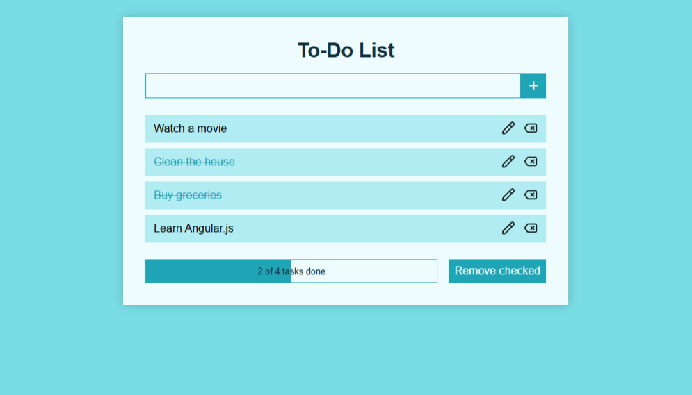

# ToDoList 📝

A clean and functional To-Do List web app built with **vanilla JavaScript**.  
This project showcases my skills in working with **DOM manipulation**, **objects**, **event handling**, and general **JavaScript logic**.

🌐 Live Demo: [to-do-list.vercel.app](https://to-do-list-beta-six-99.vercel.app/)

---

## 🚀 Features

- ✅ Add, update, and remove tasks
- ✅ Mark tasks as completed with checkboxes
- ✅ Visual progress bar that updates dynamically
- ✅ Filter to remove all completed tasks
- ✅ Smooth animations and transitions
- ✅ Fully responsive layout
- ✅ Saved task list using `localStorage`

---

## 🛠️ Built With

- HTML5
- CSS3
- JavaScript (ES6+)
- Deployed on [Vercel](https://vercel.com/)

---

## 📸 Screenshots

  

---

## 🧑‍💻 Author

**Agustín Ezequiel Calpe Monzón**  
📧 [agustincalpedm@gmail.com](mailto:agustincalpedm@gmail.com)  
🌐 [LinkedIn](https://www.linkedin.com/in/agustin-calpe/)
